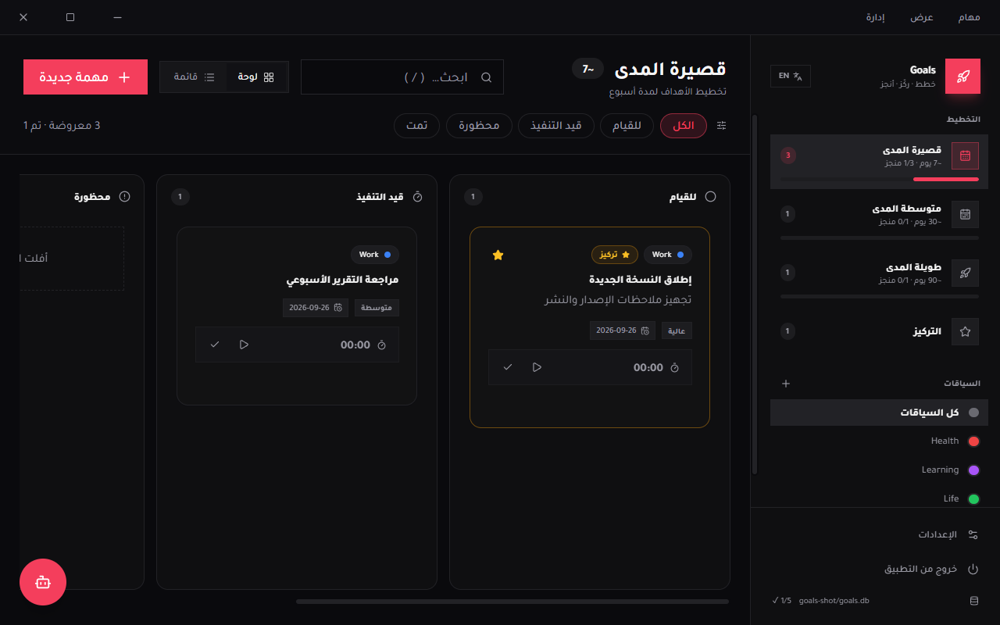

# Goals — single-file desktop planner (Wails + SQLite + MCP)

[](https://github.com/iMohamedSheta/goals/actions/workflows/ci.yml)
[](https://github.com/iMohamedSheta/goals/releases/latest)

One `goals.exe`, no installer, no DLLs, no server. Offline-first.
SQLite is pure-Go (`modernc.org/sqlite`) and the frontend is embedded — the exe is the whole app.
Frameless window: no OS chrome or menu — the in-app top menu (مهام/عرض/إدارة) is the
title bar with drag + normal min/max/close buttons (close hides to tray).



The same exe is also an **MCP server**, so AI assistants (opencode, Claude, Cursor, …)
can read and manage your goals from any project. GUI and AI share one `goals.db`.

## Download

1. Open the [**latest release**](https://github.com/iMohamedSheta/goals/releases/latest)
2. Under **Assets**, download **`goals.exe`** (single file, no installer, no DLLs)
3. Double-click `goals.exe` to run — your data is stored in `%APPDATA%\Goals\goals.db`
4. If Windows SmartScreen warns (the exe is unsigned): **More info → Run anyway**

New versions install themselves: the sidebar footer shows the running version
(`v…`, or `vdev` for local builds); when a newer release exists a green
**Update available** badge appears — open **Settings → Data** to check,
download, and restart into the update. The app also checks silently at most
once a day. (`goals.exe --version` prints the embedded version.)

## Contents

- [Download](#download)
- [Run](#run)
- [Features](#features)
- [MCP — talk to your tasks from any AI app](#mcp--talk-to-your-tasks-from-any-ai-app)
  - [How it works](#how-it-works)
  - [opencode (global — every project)](#opencode-global--every-project)
  - [opencode (this project only)](#opencode-this-project-only)
  - [Claude Desktop](#claude-desktop)
  - [Claude Code (CLI)](#claude-code-cli)
  - [Cursor](#cursor)
  - [Windsurf](#windsurf)
  - [Any other MCP client](#any-other-mcp-client)
  - [Tools reference](#tools-reference)
  - [Example prompts](#example-prompts)
- [Background timer + mini window](#background-timer--mini-window)
- [Data, troubleshooting](#data-troubleshooting)
- [Build from source](#build-from-source)
- [Releasing](#releasing)
- [Project layout](#project-layout)

## Run

- GUI: double-click `build/bin/goals.exe`
- Data: `%APPDATA%\Goals\goals.db` (override with the `GOALS_DB_PATH` env var).
  Databases left next to the exe by older versions are copied over automatically (never deleted).
  Click the database line in the sidebar footer (or Settings → Data) to open the folder.
- Rebuild: `wails build -platform windows/amd64 -o goals.exe`
- If the app ever shows a blank page: open Task Manager, end **every** `goals.exe`
  (a stuck old instance holds the single-instance lock), then launch fresh.
  Frontend errors are also logged to `%TEMP%\goals-error.log`.

## Features

- **Arabic-first, RTL** — full Arabic UI (عربي) with an EN toggle in the sidebar
- **Planning tabs**: Short-Term (~7d), Medium-Term (~30d), Long-Term (~90d) — plus **custom tabs**:
  add any timeline (e.g. quarterly) from Settings → Planning; tabs append in order;
  deleting a tab is refused while it still has tasks (and the last tab can never go)
- **Timelines editable**: Settings → Planning — change Arabic/English label, default days and
  description per tab. New tasks auto-set `due = today + tab default days`
- **Settings window** (sidebar ⚙ + Manage menu) with tabs:
  - **Appearance**: theme dark/light/system, 9 accent colors, Cairo/Tajawal/system fonts in
    4 sizes, 5 corner radii, card styles (elevated/bordered/flat/glass), shadows on/off,
    density (comfortable/compact/spacious), glassy sidebar, card-description previews,
    motion on/off — live preview, applies instantly, persists in SQLite
    (also controllable via MCP `get_settings` / `set_setting`)
  - **Planning**: edit all tabs + add/delete custom ones
  - **Contexts**: Work / Life / … manager (rename, recolor, add, delete)
  - **Data**: database path (copy + open folder), local `.db` import, Google Drive backup
  - **AI**: connect guide — server command, global opencode config, all 22 tools,
    and a ready copy-paste prompt that makes any AI register the server itself
- **Kanban + List**: toggle per tab; drag & drop between To Do / In Progress / Blocked / Done
- **Focus mode**: ★ pin tasks, then ★ Focus to see only what matters
- **Contexts**: Work / Life / Health / Learning seeded; filter chips per context.
  Search with `/`, new task with `Ctrl+K`
- **Task editor as side sheet**; **confirmations as centered modals** (delete, finish)
- **Task timer**: ▶ start / ⏸ pause / ✓ finish on every card and row.
  Set a **max time estimate** per task (hours + minutes in the editor) — when the running
  timer passes it you get a Windows toast plus a red overtime badge in the app, title and tray.
  Finish stops the timer, saves total tracked time and marks the task done with completion time.
  Per-task time history lives in the editor sheet

## MCP — talk to your tasks from any AI app

### How it works

`goals.exe` has two modes in one binary:

| Command | What it does |
|---|---|
| `goals.exe` | Desktop GUI |
| `goals.exe mcp [--db path]` | MCP server over stdio (JSON-RPC, protocol `2024-11-05`) |

Any MCP-compatible client launches `goals.exe mcp` as a subprocess and talks to it over
stdin/stdout. Both modes use the **same database** (default: `goals.db` next to the exe,
or `GOALS_DB_PATH` if set), so something you add from chat instantly appears in the app.

> The MCP mode never touches the GUI single-instance lock — the app and the AI
> can run side by side with zero conflicts.

### opencode (global — every project) ⭐ recommended

Put this in your **global** config so the tools are available in *every* project, no
per-project setup needed:

File: `C:\Users\<you>\.config\opencode\opencode.jsonc`

```jsonc
{
  "$schema": "https://opencode.ai/config.json",
  "mcp": {
    "goals": {
      "type": "local",
      "command": ["E:\\laragon\\www\\go\\goals\\build\\bin\\goals.exe", "mcp"],
      "enabled": true
    }
  }
}
```

Then **restart opencode** (MCP servers connect when a session starts).
From any repo you can now say *"add a short-term goal…"* or *"what's focused?"*.

Optional — pin the database explicitly (only needed if you move the exe):

```jsonc
"goals": {
  "type": "local",
  "command": ["E:\\laragon\\www\\go\\goals\\build\\bin\\goals.exe", "mcp"],
  "enabled": true,
  "environment": { "GOALS_DB_PATH": "E:\\laragon\\www\\go\\goals\\build\\bin\\goals.db" }
}
```

### opencode (this project only)

This repo already ships an `opencode.json` with the same server block, so anyone working
inside `E:\laragon\www\go\goals` gets the tools without touching global config.

### Claude Desktop

File: `%APPDATA%\Claude\claude_desktop_config.json` (create it if missing):

```json
{
  "mcpServers": {
    "goals": {
      "command": "E:\\laragon\\www\\go\\goals\\build\\bin\\goals.exe",
      "args": ["mcp"]
    }
  }
}
```

Restart Claude Desktop → hammer/menu → connect. Tools appear as `goals__list_tasks`, etc.

### Claude Code (CLI)

```sh
claude mcp add goals -- E:\laragon\www\go\goals\build\bin\goals.exe mcp
```

Verify with `claude mcp list`. Scope it with `-s user` (all projects) or `-s project`
(current directory only):

```sh
claude mcp add -s user goals -- E:\laragon\www\go\goals\build\bin\goals.exe mcp
```

### Cursor

Settings → **MCP** → **Add custom MCP** (opens `mcp.json`):

```json
{
  "mcpServers": {
    "goals": {
      "command": "E:\\laragon\\www\\go\\goals\\build\\bin\\goals.exe",
      "args": ["mcp"]
    }
  }
}
```

### Windsurf

`~/.codeium/windsurf/mcp_config.json`:

```json
{
  "mcpServers": {
    "goals": {
      "command": "E:\\laragon\\www\\go\\goals\\build\\bin\\goals.exe",
      "args": ["mcp"]
    }
  }
}
```

Refresh/reload the MCP servers from the Windsurf status bar.

### Any other MCP client

Any client that speaks MCP over stdio just needs:

- **command**: full path to `goals.exe`
- **args**: `["mcp"]`
- **env (optional)**: `GOALS_DB_PATH` to pin the database file

### Tools reference

22 tools, all operating on the shared `goals.db`:

| Tool | What it does | Key params |
|---|---|---|
| `list_tasks` | List tasks with filters | `horizon` (short/medium/long/custom-key/all), `status`, `contextId`, `focusOnly`, `search` |
| `get_task` | One task by id | `id` |
| `create_task` | New task (due defaults to today + tab timeline) | `title`*, `horizon`, `status`, `contextId`, `priority`, `startDate`, `dueDate`, `focus`, `maxSeconds` (estimate → overtime alert) |
| `update_task` | Edit all fields | `id`*, `title`*, + same as create |
| `move_task` | Move kanban column | `id`*, `status`* |
| `toggle_focus` | Pin/unpin from Focus | `id`* |
| `delete_task` | Delete | `id`* |
| `list_contexts` | Work / Life / … | — |
| `create_context` | New context | `name`*, `color` |
| `list_horizons` | Tabs + timeline defaults | — |
| `update_horizon` | Edit tab (partial ok) | `key`*, `label`, `labelAr`, `defaultDays`, `description`, `descriptionAr` |
| `create_horizon` | New planning tab | `label`/`labelAr`, `defaultDays`, `description`, `descriptionAr` |
| `delete_horizon` | Delete tab (refused if it has tasks) | `key`* |
| `focus_list` | Only ★ tasks | `horizon` |
| `stats` | Counts per tab/status, total, focused, done | — |
| `start_timer` | Start tracker (auto-pauses any other) | `id`* |
| `stop_timer` | Pause + save segment | `id`* |
| `finish_task` | Stop timer, save time, mark done | `id`* |
| `active_timer` | Currently running timer + live seconds | — |
| `task_time` | Total seconds + session history | `id`* |
| `get_settings` | Appearance/settings map | — |
| `set_setting` | Change one, e.g. `appearance.accent=emerald` | `key`*, `value`* |

`*` = required. Dates are `YYYY-MM-DD`. Status: `todo|in_progress|done|blocked`.
Priority: `low|medium|high|urgent`.

### Example prompts

- "what's on my focus list?"
- "add a short-term work goal: finish report by Friday, high priority"
- "move ‹task› to done and show my stats"
- "change my short-term timeline to 14 days"
- "add a quarterly tab for Q4 and put a goal in it"
- "start the timer on ‹task›" / "how much time is tracked on ‹task›?"
- "switch the app to light mode with the emerald accent"

## Background timer + mini window

- Closing the window (✕) **does not quit** — the app hides and any running timer keeps
  tracking. A **tray icon** stays in the hidden-icons area by the clock:
  right-click it for Show / Quit.
- Launching `goals.exe` again also restores the window (single-instance).
- The window title always shows the live timer (`⏱ 12:34 · task name`); the tray tooltip does too.
- The header pill (or ⧉ button) shrinks the app into a **tiny horizontal widget bar**
  stuck to the screen edge (always-on-top: dot + live time + task, ~200px).
  Click it to open the **side timer view** with full controls; collapse back or expand
  to the full app from there.
- Timer state checkpoints to SQLite every 30s, so even a kill loses almost nothing.
- Sidebar ⏻ button stops the timer, saves, and quits for real.

## Data, troubleshooting

- Database: `%APPDATA%\Goals\goals.db` (`GOALS_DB_PATH` overrides). Old exe-side databases
  are auto-copied there on first launch. WAL mode — the `-wal`/`-shm` sidecars are normal.
  Open the folder from the sidebar footer or Settings → Data.
- Blank/dark window on launch → an old stuck instance is holding the single-instance lock:
  end **all** `goals.exe` in Task Manager, then launch fresh.
- Frontend crashes render a red error panel and append to `%TEMP%\goals-error.log` — send that file when reporting a bug.

## Google Drive backup

Settings → Data → Google Drive. Sign-in runs on **`imohamedsheta/xsocial`'s Google
Device flow**: click **Connect Google** → the app shows a short code and opens Google →
enter the code → done. No localhost server, no firewall popups, and the token
(with offline refresh) stays in your local database.

The app ships with its OAuth client baked in and uses the least-privilege
`drive.file` scope — it can only ever see the backup files it created itself,
inside a "Goals Backups" folder. (An "advanced" section accepts your own
client ID/secret override if you ever need it.)

Then: **Back up now** uploads a clean snapshot (`goals-backup-YYYY-MM-DD-hhmmss.db`,
taken via `VACUUM INTO` without closing anything). Each entry offers **Restore**
(replaces the live DB after a validity check, then reloads) and delete.
**Import file…** restores from a local `.db` file instead. Disconnecting only forgets
the local token — Drive files stay untouched.

No Google involved? Every launch also drops a timestamped snapshot into
`%APPDATA%\Goals\backups` automatically (newest 7 kept) — zero-config safety net.

## Build from source

### 1. Clone

```sh
git clone https://github.com/iMohamedSheta/goals.git
cd goals
```

### 2. Requirements

- **Go 1.26+** (see `go.mod`)
- **Node 20+**
- **Wails v2 CLI** (pinned to match `go.mod`):

```sh
go install github.com/wailsapp/wails/v2/cmd/wails@v2.10.2
```

### 3. Start the dev environment

```sh
wails dev
```

This opens the app window with frontend hot-reload — edit anything under
`frontend/src/` and the UI refreshes instantly. The first run also installs
frontend dependencies and generates the `frontend/wailsjs/` Go bindings
(those files are committed, so plain `npm run build` in `frontend/` works too).

> Tip: point the dev run at an isolated database so you never touch your real
> data: `GOALS_DB_PATH=%TEMP%\goals-dev.db wails dev`
> (PowerShell: `$env:GOALS_DB_PATH="$env:TEMP\goals-dev.db"; wails dev`).

### 4. Checks before you push

```sh
go test ./... -count=1
go vet ./...
staticcheck ./...              # go install honnef.co/go/tools/cmd/staticcheck@latest
staticcheck -checks "all" ./...  # style lint
```

PRs and pushes to `main` run the same gates in CI (`CI` workflow).

### 5. Production build

```sh
wails build -platform windows/amd64 -o goals.exe
# output: build/bin/goals.exe  (~15 MB, single file, pure-Go SQLite, no cgo)
```

Frontend lives in `frontend/` (React + Vite + Tailwind, shadcn-style tokens, Cairo/Tajawal
self-hosted woff2). Arabic/English with full RTL mirroring.

## Releasing

Every push to `main` publishes a new GitHub Release automatically
(`.github/workflows/release.yml`): the exe is built with Wails, screenshotted
while running with demo data, and uploaded as `goals.exe` + `screenshot.png`.
The release tag is baked into the exe
(`-ldflags "-X goals/internal/update.Version=…"`, surfaced via
`GetVersion()` / `--version`) so the in-app updater in Settings → Data can
detect, download, and install newer releases.

The version bump follows [Conventional Commits](https://www.conventionalcommits.org/):

| Commit message | Bump |
|---|---|
| `feat: ...` / `feat(scope): ...` | minor (`x.Y.0`) |
| `fix: ...` / `fix(scope): ...` | patch (`x.y.Z`) |
| `...!:` / `BREAKING CHANGE` in body | major (`X.0.0`) |
| anything else (`docs:`, `chore:`, …) | patch |

Add `[skip release]` to the HEAD commit message to skip publishing.
Pushes that don't touch the shipped app (docs, `docs/`, `.github/`, `scripts/`)
are skipped automatically — they batch up into the next app release instead.
Pull requests and pushes run `CI` instead: `go build`, `go test`, `go vet`,
`staticcheck` (bug detection) plus `staticcheck -checks "all"` (style lint),
and the frontend `vite build`.
(`golangci-lint` releases are not built for Go 1.26 yet, so CI uses the
source-built honnef.co tools instead — same coverage, no version gate.)

## Project layout

- `main.go` — GUI boot (frameless, hide-on-close, single-instance restore, tray) + `mcp` subcommand switch
- `app.go` — Wails bindings (CRUD, timer, horizons, settings, quit) + 1s timer ticker (title, tray tooltip, frontend events)
- `internal/store/store.go` — SQLite schema + queries (`elapsed_seconds`, `timer_started_at`, `time_entries`, `settings`, custom-horizon `position`)
- `internal/mcp/server.go` — MCP stdio server (protocol 2024-11-05), 22 tools
- `internal/tray/` — system-tray icon (Show/Quit, live timer tooltip)
- `frontend/src/` — React UI: `App.jsx`, `components/` (Board, Sidebar, Menubar, SettingsSheet, sheets…),
  `lib/` (`i18n.js` ar/en, `appearance.js` visuals engine), self-hosted fonts in `assets/fonts`
- `opencode.json` — project-level MCP wiring (global config recommended for daily use)
